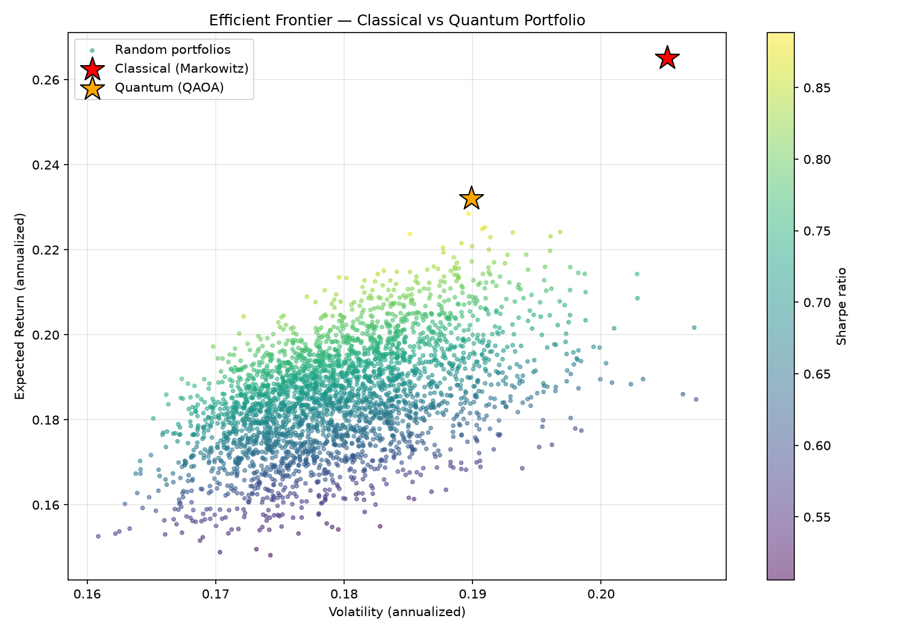
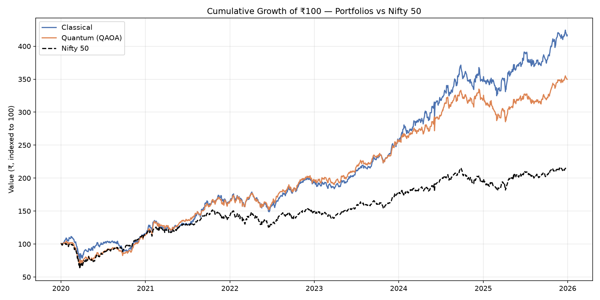
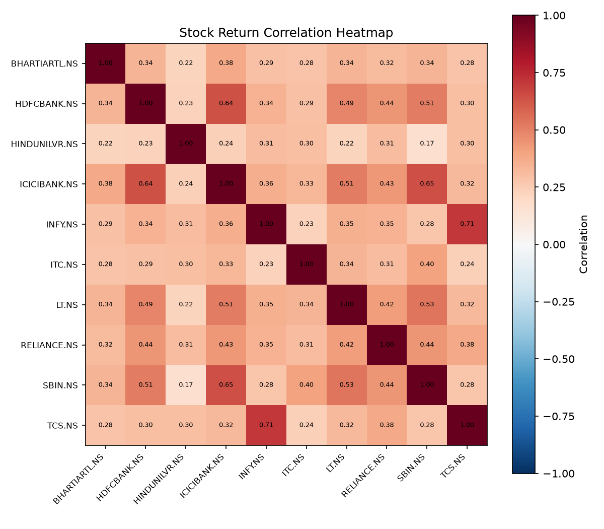

# Quantum vs Classical Portfolio Optimization — NSE/BSE

A comparative study of quantum-inspired portfolio optimization (QAOA) against
classical mean-variance (Markowitz) optimization, applied to stocks listed on
India's National Stock Exchange (NSE) and Bombay Stock Exchange (BSE).

## Motivation

Portfolio optimization is a combinatorial problem that scales poorly for
classical solvers as the number of assets and constraints grows. Quantum
Approximate Optimization Algorithm (QAOA) reformulates the problem as a QUBO
(Quadratic Unconstrained Binary Optimization) and searches for good solutions
using a parameterized quantum circuit. This project benchmarks that approach
against the textbook classical baseline on real Indian equity data.

## Project Structure

```
quantum-portfolio-nse-bse/
├── data/                    # cached price data (NSE/BSE) — gitignored
├── src/
│   ├── data_loader.py       # fetch & clean stock data (yfinance)
│   ├── classical_opt.py     # Markowitz / mean-variance baseline
│   ├── quantum_opt.py       # QAOA-based optimizer (simulator + hardware)
│   ├── utils.py             # risk/return metrics, covariance calc
│   └── backtest.py          # compare classical vs quantum results
│   └── benchmark_metrics.py  # IR, transfer coefficient, VaR, scenarios vs Nifty 50
├── notebooks/
│   └── analysis.ipynb       # exploration + visualizations
├── results/                 # output charts, comparison tables
├── tests/
│   ├── test_utils.py
│   └── test_benchmark_metrics.py
├── requirements.txt
├── .env.example              # IBM Quantum token placeholder
└── README.md
```

## Approach

1. **Universe selection** — a basket of liquid NSE/BSE stocks (`.NS` / `.BO`
   tickers via `yfinance`).
2. **Statistics** — expected returns and covariance matrix from historical
   daily returns.
3. **Classical baseline** — mean-variance optimization solved with `cvxpy`,
   producing the efficient frontier and max-Sharpe portfolio.
4. **Quantum formulation** — the same portfolio selection problem, discretized
   into asset-selection binary variables, is expressed as a QUBO and solved
   with `qiskit-optimization`'s `PortfolioOptimization` application + QAOA.
5. **Execution backends**:
   - **Simulator (default)**: Qiskit Aer, for fast iteration and debugging.
   - **Real hardware**: IBM Quantum backends via `qiskit-ibm-runtime`, once
     the simulator pipeline is validated. Toggle with `--backend` (see below).
6. **Comparison** — Sharpe ratio, weights, runtime, and solution stability
   between classical and quantum approaches.

## Setup

```bash
git clone https://github.com/<your-username>/quantum-portfolio-nse-bse.git
cd quantum-portfolio-nse-bse
python -m venv venv
source venv/bin/activate   # Windows: venv\Scripts\activate
pip install -r requirements.txt
cp .env.example .env       # add your IBM Quantum token here (optional, for hardware runs)
```

## Usage

Run on the local simulator (default):

```bash
python -m src.main --stocks config/stocks.yaml --backend simulator
```

Run on real IBM Quantum hardware (requires a configured IBM Quantum account
and token in `.env`):

```bash
python -m src.main --stocks config/stocks.yaml --backend ibm_hardware
```

Outputs (weights, efficient frontier plot, comparison table) are written to
`results/`.

## Benchmarking against Nifty 50

`src/benchmark_metrics.py` compares either optimized portfolio against the
Nifty 50 (`^NSEI`) over a trailing window, computing:

- **Sharpe ratio** — annualized, net of a configurable risk-free rate
- **Information Ratio (IR)** — active return over tracking error vs. Nifty 50
- **Transfer Coefficient (TC)** — Grinold–Kahn style estimate of how much of
  the "ideal" unconstrained alpha signal survives the portfolio's actual
  constraints (long-only, cardinality/budget, QAOA discretization). Useful
  for seeing how much the quantum solution's constraints cost you vs. the
  classical one.
- **VaR** — both historical-simulation and parametric (variance-covariance),
  at 95%/99%, plus *relative* VaR of the active (portfolio − benchmark)
  return series
- **Beta vs. Nifty 50**
- **Scenario testing** — a forward-looking Monte Carlo shock (multivariate
  normal draws from the historical mean/covariance, no network required) and
  historical scenario replay (COVID crash, 2022 rate-hike selloff, 2018
  IL&FS crisis — edit `HISTORICAL_SCENARIOS` in `benchmark_metrics.py` to add
  your own windows)

Run it as part of the main pipeline:

```bash
python -m src.main --stocks config/stocks.yaml --backend simulator --benchmark --benchmark-days 252
```

`--benchmark-days` sets the trailing window (default 252 trading days, ~1
year). This prints a full metrics report for both the classical and quantum
portfolios against Nifty 50.

**Note:** the historical scenario replay makes additional network calls
per scenario (to pull prices for each stress window) — expect it to take
longer than the main run. The Monte Carlo shock test doesn't need network
access since it draws from the already-computed mean/covariance.

## Roadmap

- [x] Classical mean-variance baseline
- [x] QAOA formulation on Aer simulator
- [ ] Validate on IBM Quantum real hardware
- [ ] Extend universe size / test noise mitigation on hardware
- [ ] Add transaction-cost-aware constraints
## Results






## Disclaimer

This is a research/educational project exploring quantum computing applied to
finance. It is not investment advice, and results on NISQ-era hardware are
expected to be noisy relative to the simulator baseline.

## License

MIT
